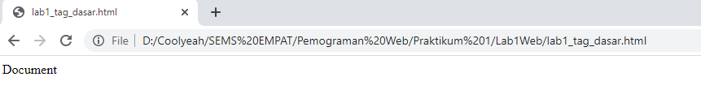
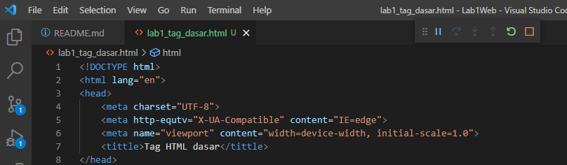
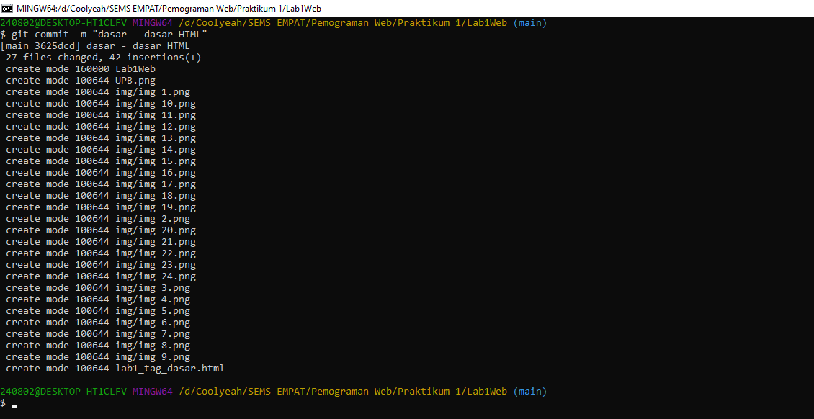
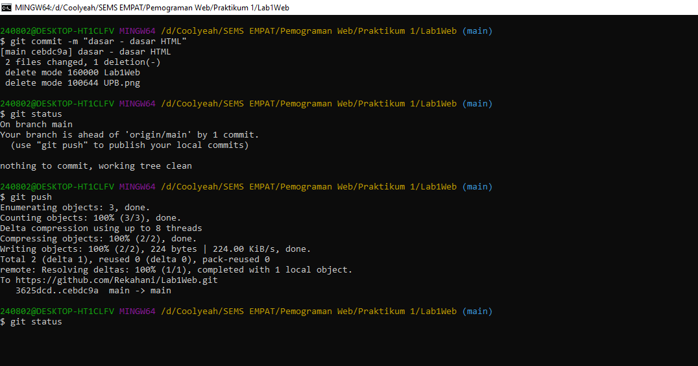

# Lab1Web

Dasar - dasar tag HTML (Praktikum 1)

HTML (HyperText Markup Language) adalah suatu bahasa yang menggunakan tanda-tanda tertentu (tag) untuk menyatakan kode-kode yang harus ditafsirkan oleh browser agar halaman tersebut dapat ditampilkan secara benar.

## Membuat Repository

1. login github buat repository baru dengan judul **Lab1web**

2. clone URL github Lab1web

setelah di clone maka akan ada folder dan file README

## Membuat halaman web dasar 

1. buka text editor (disini saya menggunakan VS Code sebagai editor)
2. kemudian kelik **file** pilih **open folder**, buka folde yang tadi di clone (**Lab1Web**)

3. maka akan tampil sebagai berikut

4. buat file baru dengan nama `lab1_tag_dasar.html`

5. buatlah struktur HTML 

dokumen masih kosong 

6. ubah title menjadi `Tag HTML dasar`

7. membuat 2 paragraf menggunakan tag `

`

maka akan tampil sebagai berikut

8. kemudian mengatur atribut paragraf dengan menggunkan `atribut align`

    atribut align="right" -> mengatur paragraf di posisi kanan
    atribut align="center" -> mengatur paragraf di posisi tengah
    atribut align="left" -> mengatur paragraf di posisi kiri

9. membuat judul halaman menggunakan tag `h1 dan h2`

maka akan tampil sebagaiberikut...

### Tag Heading
    Heading merupakan sebuah judul yang biasanya digunakan pada sebuah halaman artikel pada web.
    Atau terkadang dibeberapa bagian dari halaman web.
    Judul atau heading pada dokumen HTML dapat dibuat dengan menggunakan tag <h1> sampai <h6>.
    Tag <h1> merupakan judul pada lever pertama, kemudian level berikutnya atau sub judul pada tag
    <h2> dan seterusnya sampai tag <h6>.

    <h1>Heading 1</h1>
    <h2>Heading 2</h2>
    <h3>Heading 3</h3>
    <h4>Heading 4</h4>
    <h5>Heading 5</h5>
    <h6>Heading 6</h6>

### Contoh format teks

    
Teks <b>ini dicetak tebal</b>

    
Teks <i>ini dicetak miring</i>

    
Dan ini adalah subscript dan superscript

10. menambahkan gambar pada dokumen dengan menggunakan tag `img`

    

maka akan tampil sebagai berikut

11. membuat link navigasi menggunakan tag `nav` dan tag `a`

    <nav>
      <a href="lab1_tag_dasar.html">Dasar HTML</a>
      <a href="lab1_halaman2.html">Halaman 2</a>
      <a href="https://www.google.co.id/">Halaman Web Eksternal Google</a>
    </nav>

tag `hr` berfungsi menambahkan garis 

## push ke halaman repository

1. pertama buka `git bas` 
2. masuk ke folder `Lab1Web`

    cd Lab1Web

    git status -> untuk memeriksa apakah ada perubahan di repository
    git add "nama file/folder" atau git add . -> untuk memasukan perubahan ke repository
    git commit -m "pesan" -> untuk memberikan pesan atau deskripsi apa saja yang berubah
    git push -> untuk mengirim file dari git bas ke github

maka akan ada file html di github 

